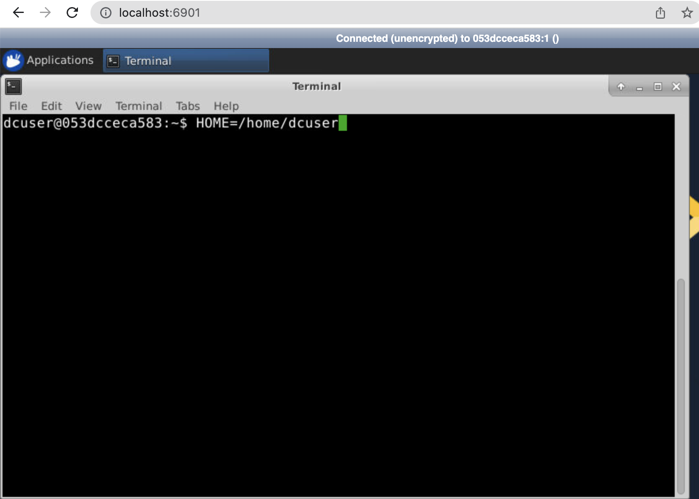

```{r setup, include=FALSE}
knitr::opts_chunk$set(echo = TRUE)
```


# Overview

The workshop is designed to give you an introduction to using the command-line to perform Bioinformatics analysis. The particular use-case is that of RNA-seq data, but many of the concepts are used for other types of analysis. There are several reasons why we might want to use the command-line in Bioinformatics:-


- Complex data such as that generated by “high-throughput sequencing” require specialised tools for analysis
- These tools might not be available on Windows or Mac computers
  + e.g. many NGS tools are developed for a *Unix* environment
- Some tasks require more memory (RAM) and processor speed than we have on our own machine
- Some analyses take too long, and whilst they are running everything else on our machine will be slow 
- Eventually you will want to use “High-performance computing” (HPC) - but this requires some background knowledge before you can use it

## Links to Individual Sections

- [Transfering files and Assessing Read Quality](part01.nb.html)
- [Alignment and Quantification - OPTIONAL](part02.nb.html)
- [Workflows, Pipelines and Workflow Managers](part03.nb.html)


# Objectives: After this course you should be able to:

- Run Bioinformatics programs from the command-line
- Locate and download reference genome references from resources such as Ensembl
- Perform QC on a set of sequencing reads
- Use salmon to produce gene quantifications
- Recognise why a using a pre-build pipeline would be beneficial - and how to locate one

# Aims: During this course you will learn about

- Quality assessment of NGS data
- A basic workflow for processing RNA-seq data
- Workflow management systems (such as nextflow), and why they are a recommended approach for running Bioinformatics pipeline


We will also review some command-line basics to perform tasks such as:-

- log into a command-line environment
- listing the contents of a directory using `ls`
- navigate through a file system using `cd`
- moving and copying files using `cp` and `mv`

Please see below for a fuller introduction

- [Introducing the Shell](https://datacarpentry.org/shell-genomics/01-introduction)
- [Navigating Files and Directories](https://datacarpentry.org/shell-genomics/02-the-filesystem.html)
- [Working with Files and Directories](https://datacarpentry.org/shell-genomics/03-working-with-files.html)

There is also a reference guide available for some common commands

- [Unix Cheatsheet](https://upload.wikimedia.org/wikipedia/commons/7/79/Unix_command_cheatsheet.pdf)


# Workshop environment

If attending a version of this workshop running by the Sheffield Bioinformatics Core, you will get access to a fully-working Unix environment that can be accessed from your web-browser. As part of the course setup will receive a web-address that is unique to each participant. **These will only work for the duration of the workshop**. 

**You will receive a link to a spreadsheet containing a set of IP Addresses for each participant**

Enter the following address in your web browser, replacing **IP_ADDRESS** with your own **IP**.

```
http://IP_ADDRESS:6901/?password=vncpassword
```

e.g. 

```
http://3.8.149.23:6901/?password=vncpassword
```


Or the following will prompt you for a password, which is `vncpassword`.

```
http://IP_ADDRESS:6901
```


This environment has some of the features common to a desktop environment such as Windows or Max OSX, but is also able to run command-line tools. We have pre-installed several NGS tools for workshop.

Once the environment has been opened, a new Terminal can be opened using the Applications menu (top-left) and selecting Terminal Emulator (second option down). We will be using this terminal for the majority of the workshop.

Before proceeding, we need to enter the following command in the Terminal window and then press ENTER.

```
HOME=/home/dcuser
```




## Command-line review

We will now review the following sections of the Data Carpentry materials to (re-)familiarise ourselves with the Unix environment

- [Introduction](https://datacarpentry.org/shell-genomics/01-introduction.html#navigating-your-file-system)
- [Moving around the file system](https://datacarpentry.org/shell-genomics/02-the-filesystem.html#moving-around-the-file-system)
- [Working with files](https://datacarpentry.org/shell-genomics/03-working-with-files.html#working-with-files)
- [Creating, moving, copying and removing](https://datacarpentry.org/shell-genomics/03-working-with-files.html#creating-moving-copying-and-removing)

<a href="part01.nb.html" style="font-size: 50px; text-decoration: none">Click Here for next part</a>


# Running the environment on your own machine after the workshop

Both Mac OSX and Windows 10 have the ability to run some of the commands presented in this course to navigate around a file system, copy files and list directories. However, you may prefer to practice in a "safe" environment, such as that used during the workshop. Furthermore, the NGS tools presented may be difficult to install. 

You can launch the same computing environment on your own machine using a tool called *Docker*.

Docker is an open platform for developers to build and ship applications, whether on laptops, servers in a data center, or the cloud.

- Or, it is a (relatively) painless way for you to install and try out Bioinformatics software.
- You can think of it as an isolated environment inside your exising operating system where you can install and run software without messing with the main OS
    + Really useful for testing software
    + Clear benefits for working reproducibly
- Instead of just distributing the code used for a paper, you can effectively share the computer you did the analysis on
- For those of you that have used Virtual Machines, it is a similar concept


## Installing Docker


### Mac

- [Mac OSX - 10.10.3 or newer](https://www.docker.com/docker-mac)
- [Older Macs](https://download.docker.com/mac/stable/DockerToolbox.pkg)

### Windows

- [Windows 10 Professional](https://www.docker.com/docker-windows)
- [Other Windows](https://download.docker.com/win/stable/DockerToolbox.exe)

Once you have installed Docker using the instructions above, you can open a terminal (Mac) or command prompt (Windows) and type the following to run the environment

```
docker run  --rm -d -p 5901:5901 -p 6901:6901 --privileged sheffieldbioinformatics/unix-training
```

Entering the address in your web browser should display the environment

```
http://localhost:6901/?password=vncpassword
```


### Using the environment to analyse your own data

With the default settings, the computing environment is isolated from your own laptop; we can neither bring files that we create back to our own OS, or analyse our own data.

However, adding an `-v` argument allows certain folders on your own OS to be visible within the environment. 

Assuming the files I want to analyse are to be found in the folder `PATH_TO_FASTQ`, the following command would map that directory to the folder `/data`

```
docker run --rm -d -p 5901:5901 -p 6901:6901 --privileged -v /PATH_TO_FASTQ/:/data sheffieldbioinformatics/unix-training

```


At the terminal, we should be able to see our files with the `ls` command

```
ls /data
```

However, please bear in mind that when running an analysis using this method you will be using the resources (CPU, RAM etc) *on your own machine*. In other words, it is not replacement for using a remote cluster with large amounts of memory (see next section).

