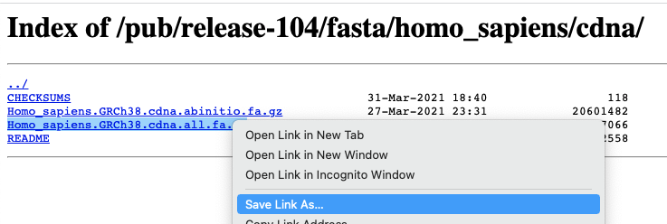

```{r setup, include=FALSE}
knitr::opts_chunk$set(echo = TRUE,eval=FALSE)
```


# Alignment vs. Quantification

Two workflows are possible with RNA-seq data - with the difference being whether one performs an alignment to the reference genome or not.

Recent tools for RNA-seq analysis (e.g. `salmon`, `kallisto`) do not require the time-consuming step of whole-genome alignment to be performed, and can therefore produce gene-level counts in a much faster time frame. 


(image from Harvard Bioinformatics Core)

A much reduced dataset will be used for illustration although the commands used can applied to more-realistic sizes of data.

We first make sure that we are located in the directory with our fastq files

```{bash eval=FALSE}
cd /data
ls
```

We will typically need some reference data for the alignment. These files have already been provided for you, but it good to know where they might be obtained.

## Obtaining reference data

Links to downloads for a variety of different organisms can be found at https://www.ensembl.org/info/data/ftp/index.html. We can navigate to the particular organism we are interested in through the interface and download the transcript and genome sequences to our laptop. 

<div class="information">
If you are running this workshop in-person using the cloud-based environment, make sure to use web-browse within the environment to access the Ensembl FTP site.
</div>

The command `wget` can be used to download a file from an FTP site to a local directory if you know the path to the file (URL). This path could be obtained by first locating the file in Ensembl and right-clicking to copy the link address.

The homepage of Ensembl FTP index links to reference data for common genomes


Files can be downloaded by clicking on the relevant link. However, we want to download the data using the command line so we have to right-click and select "Copy Link Location" (or similar)




<div class="information">
*To avoid duplication. check first (with I.T or local Bioinformaticians) that you don't have a local copy of reference genomes on your file system*
</div>

## Exercise
<div class="exercise">
We will also need the Human reference genome sequence for chromosome 22. Download the repeat-masked (`rm`) version of this sequence to the `ref_data` folder.

</div>


<div class="information">
We also recommend obtaining reference genomes from the AWS iGenomes project

- [https://ewels.github.io/AWS-iGenomes/](https://ewels.github.io/AWS-iGenomes/)

This project provides a stable and versioned resource for obtaining many reference genomes. Moreover, it has a convenient command-based interface for downloading the genomes. As it is capable of downloading large volumes of data we will not be using it in the workshop.

```
aws-igenomes.sh
```

</div>

## Workflow 1: Quantify the transcripts with salmon

Salmon is a tool for quantifying the expression of transcripts using RNA-seq data. It is based on a new
algorithm that couples the concept of quasi-mapping with a two-phase inference procedure, providing accurate
expression estimates very quickly and using little memory. It quantifies the expression of the transcripts from
a given annotation, so it is not able to identify non annotated genes and transcripts.

The documentation of the tool is available at
https://salmon.readthedocs.io/en/latest/salmon.html

Salmon is able to quantify transcript expression by using a quasi-mapping algorithm. Quasi-mappings are
mappings of reads to transcript positions that are computed without performing a base-to-base alignment
of the read to the transcript. This approach is typically much faster to compute than traditional (or full)
alignments, and can sometimes provide superior accuracy by being more robust to errors in the read or
genomic variation from the reference sequence

`salmon` requires the user to create an index from the `fasta` file of the transcripts. We have to specify a *prefix* name for all the files that `salmon` is going to create. **We only need to run this once for a given reference genome**. It can be used to align multiple samples.

```{bash eval=FALSE}
salmon index -i index/GRCh38_salmon -t ref_data/Homo_sapiens.GRCh38.cdna.chr22.fa
```

The quasi-mapping approach of `salmon` can be run with the `salmon quant` command. Help on running this tool can be displayed with the following command.

```{bash eval=FALSE}
salmon quant --help-reads
```

We need to specify the path of the index we have just created in the previous step, locations of our `fastq` files, and the library type (if unsure the option A can be used. See the help page for more options https://salmon.readthedocs.io/en/latest/salmon.html#what-s-this-libtype). We can specify where `salmon` write it's output files to, but this directory does not need to exist prior to running the command.

```{bash eval=FALSE}
salmon quant -i index/GRCh38_salmon --libType A -r ERR732901_sub.fastq.gz -o quant/ERR732901

```

<div class="exercise">

> ## Challenge 1 {.challenge}
> 
> Navigate to the quant folder and explore the files that salmon has created.
> What file contains the quantifications? 
> Use the salmon documentation to understand the various output files https://salmon.readthedocs.io/en/latest/file_formats.html#fileformats

</div>

## Workflow 2: Genome Alignment

<div class="information">
If time is running short, this section may be omitted or covered quickly. Our preferred workflow is to use salmon as described above.
</div>


We will illustrate genome alignment using the hisat2 tool, which is often used in the alignment of RNA-seq reads

- [hisat2](http://daehwankimlab.github.io/hisat2/)

Like salmon, and other aligners, we first have to create an index in a specific format for the tool to use. 

```{bash eval=FALSE}
## Make sure your reference DNA sequence is de-compressed
hisat2-build ref_data/Homo_sapiens.GRCh38.dna_rm.chromosome.22.fa index/GRCh38_hisat2
```

The command to align a specific sample is `hisat2` which requires arguments for the index location (`-x`), `fastq` file to be aligned (`-U`) and location of the output file (`-S`). Many other arguments can be used, but we will accept the defaults

```{bash}
hisat2 -x index/GRCh38_hisat2 -U fastq/ERR732901_sub.fastq.gz -S aligned_reads/ERR732901.sam
```


<div class="information">
The alignment rate reported for the alignment will be extremely low. This is to be expected as we are only aligning to a single chromosome
</div>


The output file created is an example of a Sequence Alignment/Map (SAM) file. This is a human-readable file that tells us how well and where each of our sequencing reads aligned.

```{bash eval=FALSE} 
head aligned_reads/ERR732901.sam
```

After a short section that describes the references sequences used for alignment (here we only have a single chromosome; chromosome 22). There is a tab-deliminted section describing the alignment of each read.


Column | Official Name | Brief
------ | -------------- | -----------
1      | QNAME          | Sequence ID
2      | FLAG           | Sequence quality expressed as a bitwise flag
3      | RNAME          | Chromosome
4      | POS            | Start Position
5      | MAPQ           | Mapping Quality
6      | CIGAR          | Describes positions of matches, insertions, deletions w.r.t reference
7      | RNEXT          | Ref. name of mate / next read
8      | PNEXT          | Postion of mate / next read
9      | TLEN           | Observed Template length
10     | SEQ            | Sequence
11     | QUAL           | Base Qualities

There can also be all manner of optional tags as extra columns introduce by an aligner or downstream analysis tool. A common use is the `RG` tag which refers back to the read groups in the header.


The *"flags"* in the sam file can represent useful QC information

  + Read is unmapped
  + Read is paired / unpaired
  + Read failed QC
  + Read is a PCR duplicate (see later)

The combination of any of these properties is used to derive a numeric value

- https://broadinstitute.github.io/picard/explain-flags.html


## Converting to a bam file

`sam` files are easy to read, but rarely used in analysis as they can require large amounts of disk space. The alignments from a sequencing run are more-commonly stored in compressed, binary file know as a `bam` file. Exactly the same information is contained, except they are more portable.

`samtools` is used for the conversion and manipulation of sam and bam files. 

- http://www.htslib.org/

The steps in producing a bam file for analysis are given below. The final step is important as it creates an *index file*. This index needs to be present in order for analysis tools to access the reads in the file in an efficient manner.


```{bash}
samtools view -bS aligned_reads/ERR732901.sam > aligned_reads/ERR732901.bam
samtools sort aligned_reads/ERR732901.bam aligned_reads/ERR732901.sorted
samtools index aligned_reads/ERR732901.sorted.bam
```


<div class="exercise">

> ## Challenge 2 {.challenge}
> 
> The samtools suite also includes the flagstat and idxstats tools to derive some QC from the alignment. Use the output from these tools to determine; the % of mapped reads, the number of reads mapped to chromosome 22
>

</div>

### Counting features

We will use the `featureCounts` tool to obtain transcript-level counts for the aligned reads that we have just created. This requires that `gtf` files that we downloaded from Ensembl earlier and our newly-created bam file.


```{bash eval=FALSE}
mkdir featureCounts
featureCounts -a ref_data/Homo_sapiens.GRCh38.108.chr22.gtf -o featureCounts/ERR732901.counts aligned_reads/ERR732901.sorted.bam
```

<div class="information">
The most popular aligner for DNA sequences is `bwa`. This can also be accessed using this environment using the following:-

```
bwa index
```
and

```
bwa mem

```

</div>


